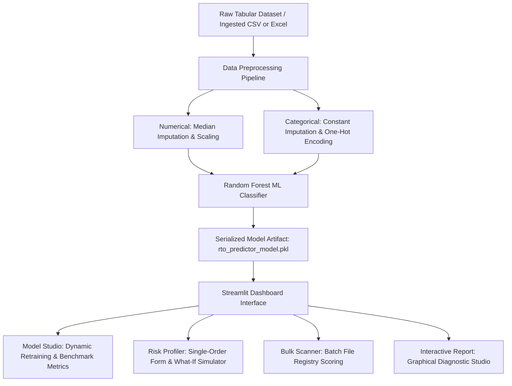

# Universal Risk Predictor: System Documentation & PPT Guide

This document provides a comprehensive overview of the **Universal Predictive Engine**. It details the system features, technical stack, installation steps, dataset configurations, dashboard features, glossary terms, and core machine learning (ML) logic.

You can use the structure, tables, and simplified explanations below as direct copy-paste content or talk tracks for your **Client PPT Presentation**.

---

## 1. System Overview & Value Proposition
The **Universal Risk Predictor** is a predictive analytics and machine learning solution designed to identify risks, forecast outcomes, and diagnose factors driving customer behavior. 

Historically, businesses suffered massive losses due to unexpected outcomes (like **Return to Origin (RTO)** packages in e-commerce, customer churn, or transaction fraud). This system solves this by providing a unified interface where users can ingest historical data, dynamically train predictive pipelines, and analyze risk patterns in real-time.

---

## 2. Robust & Domain-Agnostic Engine (Analyzing Any Dataset)
> [!IMPORTANT]
> **Key Slide Point for Clients:** While e-commerce RTO (Return to Origin) is our default reference benchmark, the system is designed as a **universal classification engine**. It can ingest, clean, train, profile, and dynamically visualize **any tabular dataset** with a binary (two-class) target variable.

Here is how the system achieves this robust dataset-agnostic adaptability:

1. **Dynamic Schema & Column Auto-Detection:**
   * When *any* custom CSV or Excel file is uploaded, the machine learning pipeline automatically analyzes it.
   * It dynamically categorizes columns into **numerical features** (e.g. price, age) or **categorical features** (e.g. category, country).
   * It automatically filters out database primary keys and unique identifiers (like `order_id` or `customer_id`) to prevent the model from memorizing row numbers (overfitting).
2. **Agnostic Preprocessing & Imputation Pipelines:**
   * It handles missing/null data on-the-fly. Empty text columns are filled with `'Unknown'` and empty numeric columns are filled with the column's *median*.
   * It scales numerical variables and encodes categorical labels dynamically, meaning the system never crashes due to format mismatches in raw data.
3. **Adaptive User Interface Form Generation:**
   * The **Dynamic Risk Profiler** input fields are not static. The Streamlit app reads the active model's metadata bundle and dynamically renders inputs (sliders for numbers, select boxes for category options) matching *only* the features inside that model.
   * Sliders automatically set their minimum and maximum boundaries based on the actual ranges found in the trained dataset.
4. **Universal Interactive Visualization Explorer:**
   * The **Interactive Report** tab adaptively populates its X-axis, Y-axis, and grouping columns from whatever columns are present in the active dataset, allowing analysts to run custom visual studies (Bar, Pie, Box Plot, Line, Histogram) on *any* dataset.

---

## 3. Technical Stack
The system is built on a modern, lightweight, and robust Python-based data science stack.

| Technology Component | Tech Used | Purpose & Function |
| :--- | :--- | :--- |
| **User Interface & Front-End** | **Streamlit** | Powers the interactive, premium web dashboard. It allows non-technical users to train models, test individual orders, and run bulk files. |
| **Machine Learning Core** | **Scikit-Learn (Sklearn)** | Handles preprocessing, imputations, data scaling, training, and evaluation using the Random Forest algorithm. |
| **Data Manipulation** | **Pandas & NumPy** | Ingests, cleans, processes, and structures tabular order registries. |
| **Interactive Visualizations** | **Plotly Express** | Renders dynamic, responsive charts (Bar, Pie, Box Plots, Histograms) for returns diagnosis. |
| **Model Serialization** | **Joblib** | Saves the trained model pipeline and metadata into a compact binary file (`.pkl`) for rapid production deployment. |
| **Excel Ingestion Engine** | **Openpyxl** | Allows the system to parse Excel workbooks (`.xlsx`) directly. |

---

## 4. System Architecture & Flowchart
Here is how the data flows from any raw spreadsheet to a live prediction inside the application:



---

## 5. Glossary of Short Terms (Acronyms)
Below are the definitions of the acronyms used throughout the system.

| Term | Full Form | Simple Business Definition |
| :--- | :--- | :--- |
| **RTO** | Return to Origin | E-commerce term: When a package cannot be delivered and is returned back to the warehouse. |
| **ML** | Machine Learning | Artificial intelligence methods that identify patterns in historical data to make automated predictions. |
| **RF** | Random Forest | The machine learning algorithm we used; it combines multiple "decision trees" to make highly accurate predictions. |
| **OOM** | Out of Memory | A computer state where code crashes due to insufficient RAM. The system uses auto-sampling to prevent this. |
| **ROC-AUC** | Receiver Operating Characteristic - Area Under the Curve | A standard metric representing how well a model distinguishes between two classes. $1.0$ is perfect; $0.5$ is random guessing. |
| **COD** | Cash on Delivery | Paying for goods by cash when they are delivered (the primary driver of RTO in online sales). |
| **OHE** | One-Hot Encoding | A preprocessing technique that converts text categories (like "Toys", "Electronics") into numbers so the ML model can read them. |
| **XLSX** | Excel Spreadsheet XML | The standard file format for Microsoft Excel files. |
| **CSV** | Comma-Separated Values | A lightweight text file used to save structured, tabular spreadsheets. |
| **PKL** | Pickle File | Python's standard binary format used to save and load the trained model configuration to disk. |
| **UI / UX** | User Interface / User Experience | The visual design, layouts, buttons, and overall feel of the software. |
| **NaN / Null** | Not a Number / Null Value | Missing data cells or empty spaces in a spreadsheet. |

---

## 6. Dataset Configuration & Column Mapping (Benchmark Example)
To demonstrate the system, we tested it on an e-commerce transactions log named `amazon_returns_dataset_cleaned.xlsx` (containing 5,000 records with 22 columns).

### The Target Column (Dependent Variable)
To train the system, you must designate a target column in the **Target Class Column** section:
* **Target Column Name:** `returned` (or `return_status` / `returnstatus`).
* **Values:** `1` represents the positive risk class (e.g. Returned / RTO, Fraudulent, Churned), and `0` represents the negative baseline class (e.g. Delivered, Normal, Retained).

### Independent Variables (Feature Selection)
When configuring analysis, use these column names to feed data into the machine learning pipeline:

#### A. Numerical Columns (Put in "Numerical Features" section):
* `price`: The price of the product. High-ticket items have different return dynamics than low-cost goods.
* `quantity`: The count of products ordered. Bulk purchases are sometimes returned due to buyer remorse.
* `previous_returns_count`: How many times this customer has returned orders in the past. **(This is one of the strongest predictive indicators!)**
* `customer_total_orders`: Total orders placed by the customer (indicates customer loyalty).
* `discount_pct`: The percentage of discount applied. Higher discount percentages generally lower the likelihood of return.
* `review_rating`: The product's customer review score. Low-rated items are returned more often.
* `seller_rating`: The rating of the merchant. Poor sellers increase return rates due to wrong sizes or descriptions.
* `customer_tenure_days`: How long (in days) the customer has had an account on the platform. New accounts pose higher risks.
* `is_prime_member`: Value `1` for Prime subscribers, `0` for regular. Helps capture membership shipping behavior.
* `delivery_days`: Estimated shipping transit duration. **(Long delivery delays strongly drive up RTO rates!)**
* `order_hour`: Hour of the day the order was placed (captures impulse buying behavior, e.g., midnight vs morning).
* `is_weekend`: Value `1` if ordered on Saturday/Sunday, `0` if ordered on weekdays.

#### B. Categorical Columns (Put in "Categorical Features" section):
* `product_category`: The category of the product (e.g., Toys, Clothing, Electronics, Books).
* `payment_method`: How the customer paid (Credit Card, Debit Card, UPI, or Cash on Delivery). **(Cash on Delivery is historically the leading cause of RTO!)**
* `shipping_type`: The shipping speed selected (Standard, Express, Overnight).
* `order_weekday`: The day of the week the order was placed (Monday, Tuesday, etc.).

#### C. Columns to Exclude / Ignore:
You must exclude these columns during model training to avoid errors or **Information Leakage**:
* `order_id`, `customer_id`, `product_id`: Unique strings/identifiers. Including them makes the model overfit (memorize specific lines) rather than learn general rules.
* `order_datetime`: Raw date-time strings. The model cannot read them directly. (The system automatically extracts `order_hour` and `is_weekend` from it first, then ignores the raw column).
* `return_reason`: This details **why** an item was returned (e.g., "damaged", "wrong size"). You only know this *after* a return happens. Including it during training will break the model's logic.
* `return_score`: A pre-calculated score from previous systems. Including it leaks the answer to the model.

---

## 7. How the Dashboard Features Drive Business Analysis
When presenting to the client, walk them through the 4 tabs of the Streamlit dashboard and how they function:

```
┌────────────────────────────────────────────────────────────────────────┐
│                      ⚙️ Model Studio (Train & Load)                    │
│ Ingest files, select "returned" target column, choose which features   │
│ to train, and view accuracy stats (Accuracy & ROC-AUC score).         │
├────────────────────────────────────────────────────────────────────────┤
│                      🎯 Dynamic Risk Profiler                          │
│ Input a single order's details (e.g. COD, 3 previous returns). It runs │
│ the model to predict RTO risk (%). Includes a What-If simulator.      │
├────────────────────────────────────────────────────────────────────────┤
│                      📁 Bulk Transaction Scanner                      │
│ Upload an Excel or CSV file of 1,000s of pending orders. The system    │
│ automatically scores and labels each line as Low, Moderate, or High   │
│ risk, allowing the client to download the scored list.                 │
├────────────────────────────────────────────────────────────────────────┤
│                  📊 Interactive Graphical Report                       │
│ Interactive charts showing the distribution of returns, missing values │
│ profiles, and a dynamic graph explorer where users can filter columns. │
└────────────────────────────────────────────────────────────────────────┘
```

### Talk-Track for Client Presentation:
1. **Model Studio:** "This is our training cockpit. We can upload any spreadsheet of past data, choose the target outcome, select the features, and train the model. A customized model is ready inside seconds."
2. **Dynamic Risk Profiler:** "Here, checkout software can send a single customer's details. The system instantly outputs a risk score. It features a **What-If Simulator**. For example, if an order has a 75% return risk because of standard shipping, we can slide the shipping speed to Express and see if the risk drops to 40%. This helps us design mitigation strategies."
3. **Bulk Transaction Scanner:** "Operations managers can upload a sheet of thousands of orders. The system classifies them in seconds. They can download the list, shipping Low Risk items, calling Moderate Risks, and putting High Risks on hold."
4. **Graphical Diagnostic Studio:** "This gives business analysts live charts. They can filter by category or region to see where risks are concentrated, or build custom charts like 'Average product price grouped by risk segment'."

---

## 8. Core Logics Explained Simply
Here is how the underlying code processes data, explained in a simple, non-technical way for slides.

### Logic 1: Automatic Column Classifier (Smart Filtering)
* **What the code does:** Loops through the spreadsheet and automatically separates numeric columns (price, quantity) from categorical columns (category, payment method).
* **The Business Benefit:** It ignores columns that represent database IDs (like `order_id` or `customer_id`) because memorizing IDs makes the model useless for future orders. It also filters out columns with too many unique text values, keeping the model clean and fast.

### Logic 2: Automated Date-Time Extraction
* **What the code does:** Takes a raw date column (e.g., `2024-10-14 01:00:00`) and breaks it into three new indicators:
  1. `order_hour`: The hour of the day (e.g., `1` for 1:00 AM).
  2. `order_weekday`: The name of the day (e.g., `Monday`).
  3. `is_weekend`: A simple flag (e.g., `1` if Saturday/Sunday, else `0`).
* **The Business Benefit:** Raw dates can't be computed. Breaking them down reveals buying behaviors—like how late-night impulse purchases on weekends are mathematically more likely to be returned.

### Logic 3: Defensive Data Sampling
* **What the code does:** If you upload a training dataset containing more than 50,000 orders, the system automatically draws a representative sample of exactly 50,000 rows.
* **The Business Benefit:** Machine learning can consume enormous computer memory. This guardrail prevents the system from running out of memory (OOM) and crashing the web server when a user uploads a huge database file.

### Logic 4: Missing Value Repair (Imputation)
* **What the code does:** If some cells in the sheet are empty:
  * For **numbers** (like price), it fills the empty cell with the middle value (the *median*) of the rest of that column.
  * For **categories** (like payment method), it fills the empty cell with the word `'Unknown'`.
* **The Business Benefit:** Standard machine learning algorithms crash if they encounter an empty cell. Our pipeline automatically repairs the gaps on-the-fly, ensuring the application never errors out.

### Logic 5: Scale Harmonization (Standard Scaling)
* **What the code does:** It standardizes numerical columns so they share a common scale.
* **The Business Benefit:** Features have very different scales—for example, product prices can be in the hundreds of dollars, while quantity is usually between 1 and 5. Without scaling, the model might assume a price of $100 is 100 times more important than a quantity of 1. Scaling standardizes these inputs so the model compares them fairly.

### Logic 6: Text-to-Number Conversion (One-Hot Encoding)
* **What the code does:** Converts words (categories) into binary columns. If a category is `Payment Method`, it creates columns: `payment_method_Credit_Card`, `payment_method_COD`, etc., marking them with `1` (Yes) or `0` (No).
* **The Business Benefit:** Computers only calculate math. This translates human language into binary digits that the algorithm can process mathematically.

### Logic 7: Random Forest Classifier (The Decision Engine)
* **What the code does:** The core ML model is a "Random Forest". Think of it as a panel of 100 different experts (Decision Trees). Each expert looks at a random subset of columns and votes on whether an order will be returned. The system counts the votes; if 70 out of 100 experts vote "returned", the order is assigned a 70% risk score.
* **The Business Benefit:** This algorithm is highly accurate, resistant to overfitting, and handles complex relationships (e.g., "COD orders are only high risk if the customer has returned more than 2 items in the past") extremely well.

---

## 9. Step-by-Step Local Setup & Execution Guide
Follow these instructions to run the machine locally on your computer:

### Prerequisites:
* **Python 3.8 to 3.12** installed on your system.
* Internet connection to install the packages for the first time.

### Step 1: Initialize Your Virtual Environment
Open **PowerShell** (Windows) or **Terminal** (macOS/Linux) and navigate to the project directory:
```bash
# Set up a virtual environment named 'venv'
python -m venv venv

# Activate it (Windows)
venv\Scripts\activate

# Activate it (macOS/Linux)
source venv/bin/activate
```

### Step 2: Install the Dependencies
Run this command to install the required libraries listed in `requirements.txt`:
```bash
pip install -r requirements.txt
```

### Step 3: Run Column Check (Optional)
Verify that the default dataset is placed and readable by running:
```bash
python check_columns.py
```
*(If you are on Windows PowerShell and get encoding character errors, run `$env:PYTHONUTF8=1; python check_columns.py` first to enable UTF-8 character printing.)*

### Step 4: Train the ML Model
Train the default Random Forest model pipeline:
```bash
python train_model.py
```
This script reads the file `data/amazon_returns_dataset_cleaned.xlsx`, runs preprocessing, trains the model, and saves the output configuration inside a new folder as `models/rto_predictor_model.pkl`.

### Step 5: Launch the Streamlit Web Application
Run the Streamlit server to open the dashboard interface:
```bash
streamlit run app.py
```

### Step 6: Access the App
Streamlit will output a local network address. Open your web browser and go to:
```
http://localhost:8501
```
The dashboard is now fully functional! You can load datasets, profile orders in real-time, scan batch spreadsheets, and explore analytical reports.
